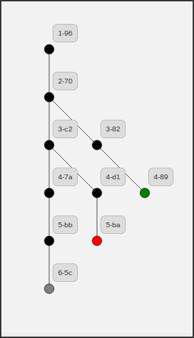

visualizeRevTree
================

Visualize couchdb/pouchdb revision tree right in your browser:

## [Demo](http://neojski.github.io/visualizeRevTree)
Just keep in mind that you can't put there `localhost:5984`.

If you want to visualize you local revision trees then get a copy of this repo
and run the `index.html` locally. Don't forget same origin policy.
